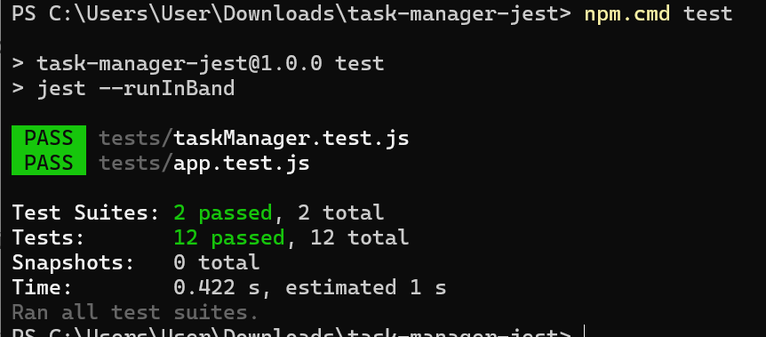
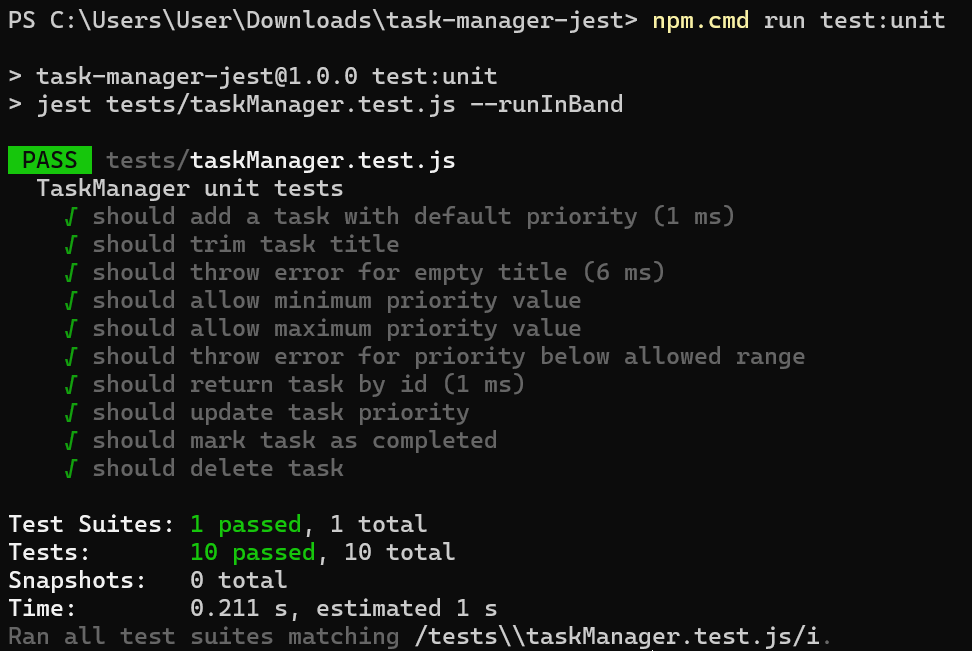
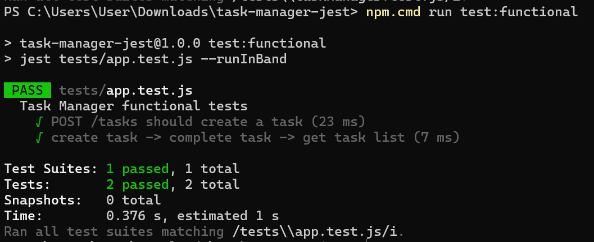
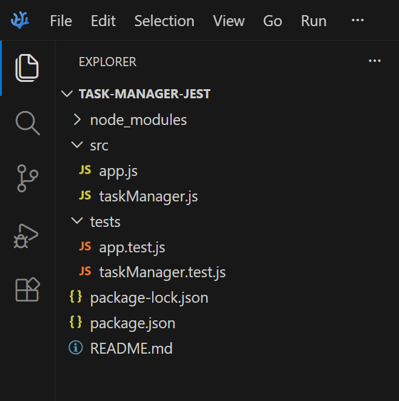

# Task Manager Jest

Простой проект для управления задачами, созданный для выполнения задания

## Возможности проекта

- создание задачи
- получение списка задач
- отметка задачи как выполненной

## Используемые технологии

- Node.js
- Express
- Jest
- Supertest

## Тестирование

В проекте реализовано:

- 10 unit-тестов
- 2 functional-теста

Итого:

- 12 тестов
- все тесты проходят успешно

## Запуск проекта

Для запуска сервера:
node .\src\app.js

После запуска сервер доступен по адресу:
http://localhost:3000

Для просмотра списка задач можно открыть:
http://localhost:3000/tasks

## Установка зависимостей

Стандартная команда:
npm install

## Запуск тестов

Запуск всех тестов:
npm.cmd test

Запуск только unit-тестов:
npm.cmd run test:unit

Запуск только functional-тестов:
npm.cmd run test:functional

## Результаты тестирования

### Общий запуск всех тестов

### Результат unit-тестов

### Результат functional-тестов

### Структура проекта

